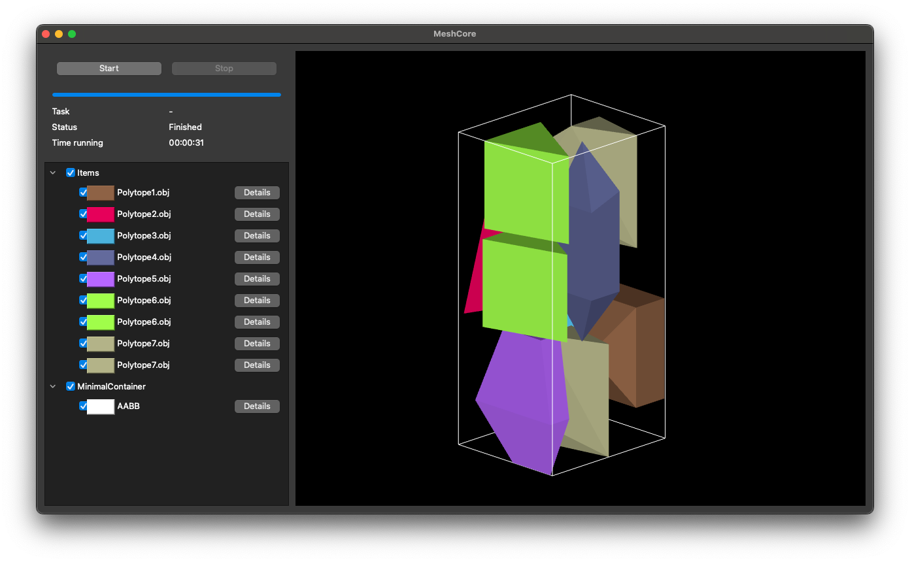

# MILP models for 3D irregular strip packing problems with convex items

## General information

`strip-milp-3d` constructs and solves exact MILP models of 3D irregular strip packing problems with convex items.
It uses the [MeshCore library](https://github.com/JonasTollenaere/MeshCore) for loading files, rendering and providing the necessary geometric operations required to construct the MILP models.

The project use uses CMake as its build system.
We recommend using vcpkg as a package manager to install the dependencies that are defined in the `vcpkg.json` file.
To set up a development environment, we refer to the [vcpkg documentation](https://vcpkg.io/en/getting-started).

The MILP models are solved using Gurobi.
CMake is not able to find the Gurobi installation automatically on every platform when using the vcpkg toolchain, so we configured the project to use the paths to the Gurobi installation as CMake variables.
See more in [CMakeLists.txt](CMakeLists.txt).

## CMake targets

- RunMILP: Runs a MILP model for a single strip packing instance. Rendered using the MeshCore UI.
- BenchmarkMILP: Generates and exports all different MILP models for a benchmark suite of strip packing instances.
- VisualizeSlices: Visualizes the slices of a strip packing instance using the MeshCore UI.
- VisualizeSolution: Render a strip packing solution using the MeshCore UI.